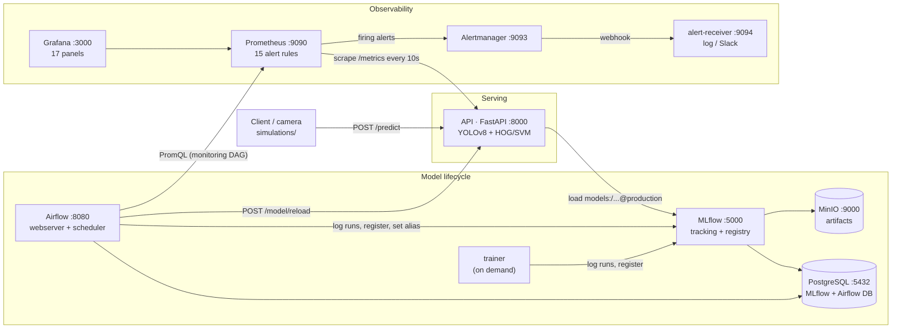
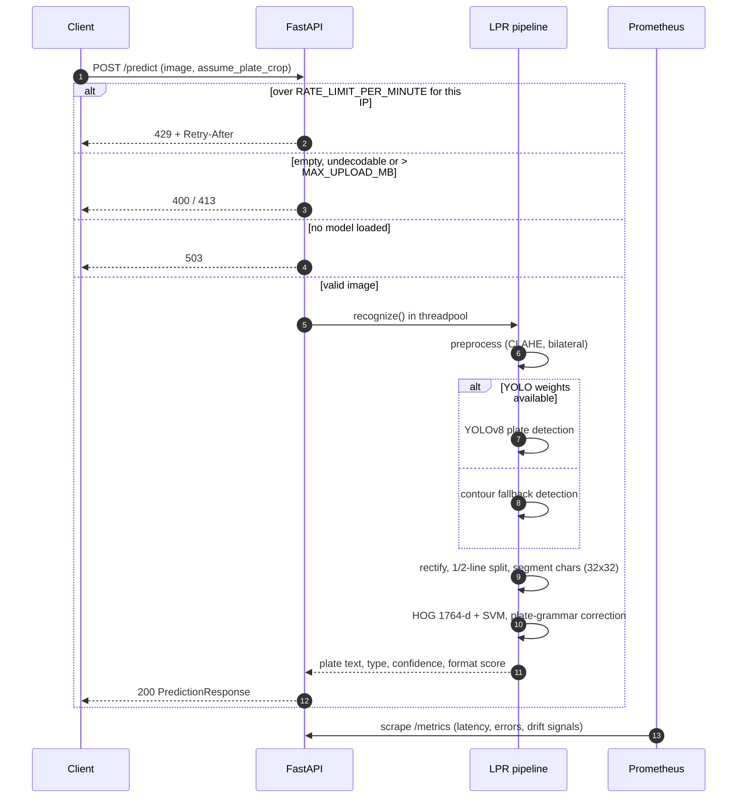
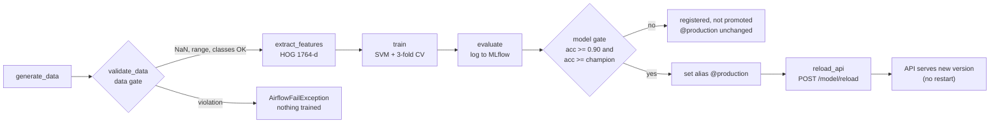
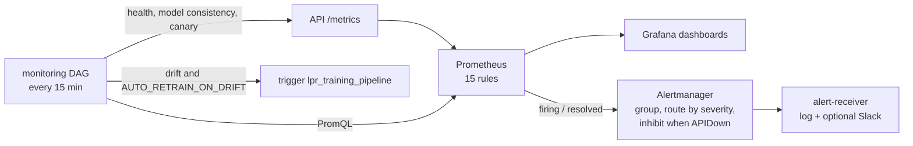

# System Architecture

## 1. High-Level Architecture

Twelve containers on one Docker Compose network (`lpr_network`): ten long-running
services plus two one-shot init containers. Every long-running service has a healthcheck.



One-shot containers: `minio-init` (creates the `mlflow-artifacts` bucket) and
`airflow-init` (creates/migrates the Airflow DB and the admin user).

---

## 2. Component Design

### 2.1. API Service (FastAPI)
**Responsibility**: Serve the end-to-end LPR model via RESTful endpoints.

- Receives image uploads (max `MAX_UPLOAD_MB`, default 10 MB), validates schemas, decodes formats, and passes images to the LPR inference pipeline.
- CPU-bound inference runs in a worker thread pool (`run_in_threadpool`) so asynchronous endpoints like `/health`, `/metrics`, and `/model/info` remain fully responsive under load.
- **Model Source (`MODEL_SOURCE`)**:
  - `mlflow`: Loads the active model tagged `@production` (`models:/lpr-ocr-classifier@production`) from the MLflow Model Registry. Falls back automatically to the baked-in `models/ocr_hog_svm` if MLflow is uninitialized.
  - `local`: Always loads from local filesystem weights.
- **Hot Reload**: `POST /model/reload` reloads the active model without service downtime, protected by the `X-Admin-Token` header (`API_ADMIN_TOKEN`).
- **Configurable Rate Limiting**: Token-window rate limiter per client IP governed by `RATE_LIMIT_PER_MINUTE` (default: 60 req/min). Returns HTTP 429 with standard `Retry-After` header when exceeded and exposes rate-limiting counters in Prometheus metrics.
- Exposes Prometheus `/metrics`, including vision data and prediction drift signals.

### 2.2. LPR Pipeline (Core ML)
**Responsibility**: Real-time end-to-end license plate recognition.

```
Input Image (RGB)
    │
    ▼
┌──────────────────┐
│ Scene Preprocessing│  CLAHE contrast enhancement (LAB space)
│                    │  Bilateral filter denoising
│                    │  Resize to max 1280px
└────────┬───────────┘
         ▼
┌──────────────────┐
│ Plate Detection   │  YOLOv8n (when weights are mounted)
│                    │  Contour-based fallback (aspect ratio 1.2–5.5)
└────────┬───────────┘
         ▼
┌──────────────────┐
│ Plate Processing  │  Perspective rectification & deskew (Hough line angle)
│                    │  Resize to 400px width; CLAHE + unsharp masking
└────────┬───────────┘
         ▼
┌──────────────────┐
│ Char Segmentation │  Multi-candidate binarization (Otsu, adaptive, Sauvola)
│                    │  Connected components analysis & 2-line split
│                    │  Normalize to 32x32 binary patches
└────────┬───────────┘
         ▼
┌──────────────────┐
│ Feature Extraction│  HOG (pixels_per_cell=4x4, orientations=9)
│                    │  Output: 1764-dimensional feature vector per character
└────────┬───────────┘
         ▼
┌──────────────────┐
│ SVM Classification│  RBF kernel, C=10, gamma=scale
│                    │  31 Vietnamese plate character classes
│                    │  Position-based digit/letter coercion
└────────┬───────────┘
         ▼
┌──────────────────┐
│ Post-Processing   │  Vietnamese license plate syntax validation & correction
│                    │  Character deduplication and confidence scoring
└────────┬───────────┘
         ▼
    Plate Text (e.g., "51F12345")
```

### 2.3. MLflow (Experiment Tracking & Model Registry)
**Responsibility**: Track experiments, maintain model version lineages, and manage S3 artifacts.

- **Backend Store**: PostgreSQL (`mlflow` database) storing parameters, metrics, tags, and run metadata.
- **Artifact Store**: S3-compatible object storage on MinIO (`s3://mlflow-artifacts`).
  - **Proxied Architecture**: The MLflow server runs with `--serve-artifacts --artifacts-destination s3://mlflow-artifacts`. Clients (API, Airflow, Trainer) interact purely through the MLflow REST API without needing AWS/S3 credentials.
- **Model Registry**: The character classifier is registered as a scikit-learn `Pipeline(scaler -> SVM)` with model metadata (feature dimensions, classes, training metrics). The alias **`@production`** dynamically marks the champion model served by the API.

### 2.4. MinIO (S3-Compatible Object Storage)
**Responsibility**: Durable, high-performance object storage for ML artifacts.

- Service runs on port `9000` (S3 API) and port `9001` (Web Management Console).
- Auto-provisioning: `minio-init` container utilizes `mc` (MinIO Client) to automatically create the `mlflow-artifacts` bucket upon startup.
- Replaces local Docker volume mounts with cloud-native S3 storage matching production deployment standards.

### 2.5. Apache Airflow (Pipeline Orchestration)
**Responsibility**: Orchestrate model retraining and continuous health & drift monitoring.

- **Architecture**:
  - `airflow-init`: One-off container running database migrations and creating default admin credentials (`admin/admin`).
  - `airflow-webserver`: Web UI at port `8080` for monitoring runs and manual execution.
  - `airflow-scheduler`: Task execution engine powered by **`LocalExecutor`** connected to the PostgreSQL `airflow` database, enabling concurrent task execution.
- **Pipelines (DAGs)**:
  1. **`lpr_training_pipeline`** (Scheduled `@weekly` or on-demand):
     - `generate_data` → `validate_data` → `extract_features` → `train` → `evaluate` → `register_model` → `reload_api`.
     - Promotes model to `@production` only when meeting accuracy thresholds (≥ 90%) and outperforming the current champion.
     - Accepts runtime configuration (e.g., triggered by drift detection) and tags runs in MLflow with `trigger_reason`.
  2. **`lpr_monitoring_pipeline`** (Scheduled every 15 minutes `*/15 * * * *`):
     - `check_api_health`: Probes `/health` and `/model/info` endpoints.
     - `check_model_consistency`: Compares the model version served by FastAPI against MLflow `@production`.
     - `canary_prediction`: Runs an automated test inference with a reference dataset image.
     - `query_prometheus_metrics`: Queries PromQL for success rates, p95 latency, error rates, and vision drift ratios.
     - `evaluate_health_and_drift`: Evaluates thresholds, generates detailed diagnostics, and flags violations.
     - `write_monitoring_report`: Saves structured JSON reports to `data/monitoring_reports/`.
     - `branch_on_drift` / `trigger_retraining`: Conditionally triggers `lpr_training_pipeline` if drift is detected and `AUTO_RETRAIN_ON_DRIFT=true`.

### 2.6. Monitoring Stack (Prometheus & Grafana)
**Responsibility**: Real-time system performance and computer vision drift monitoring.

- **Prometheus**: Scrapes `/metrics` from FastAPI every 10 seconds.
- **Alert Rules**:
  - **Production Drift Alerts (1h vs 7d window)**: Long-term drift detection for `InputBrightnessDrift`, `InputResolutionDrift`, and `LowRecognitionSuccessRate`.
  - **Fast Drift Alerts (`drift_alerts_fast`, 5m vs 1h window)**: Short-window alerts reacting within 2–5 minutes for live demonstrations and simulation scenarios (`InputBrightnessDriftFast`, `InputResolutionDriftFast`, `LowRecognitionSuccessRateFast`, `RateLimitBurst`).
- **Alertmanager** (`config/alertmanager/alertmanager.yml`): groups alerts by name and
  severity, pages critical alerts after 10s and repeats hourly, batches info alerts, and
  inhibits warnings while `APIDown` is firing. Notifications go to **alert-receiver**
  (`docker/alert-receiver/receiver.py`), which logs each alert, keeps the last 50 at
  `GET :9094/alerts` and forwards to Slack when `SLACK_WEBHOOK_URL` is set.
- **Grafana**:
  - Pre-provisioned dashboards with 10s auto-refresh (`http://localhost:3000`).
  - Panels track throughput, p50/p95/p99 latency, recognition success rates, character count distributions, input brightness/resolution curves, HTTP status codes (200/400/429), and rate-limited events.

### 2.7. Traffic & Drift Simulation Toolkit (`simulations/`)
**Responsibility**: Realistic load simulation, edge-case stress testing, and reproducible data/prediction drift generation.

- **Image Sources**: Mixed sampling from real validation images (`dataset/images/`) and on-the-fly synthetic license plates generated in memory.
- **Modular Drift Transforms**:
  - `brightness`: Simulates nightfall, dusk, or intense glare.
  - `gaussian_noise`: Simulates poor camera sensors or low-light ISO noise.
  - `motion_blur`: Simulates high-speed vehicle pass-by or rainfall.
  - `downscale` & `jpeg`: Simulates camera downgrade or heavy compression artifacts.
  - `rotate` & `occlusion`: Simulates tilted camera angles and dirty/partially covered plates.
- **7 Automated Scenarios**:
  1. *Normal Day*: Baseline traffic at 0.8 rps.
  2. *Nightfall*: Gradual brightness reduction triggering `InputBrightnessDriftFast`.
  3. *Camera Swap*: Sudden resolution shift triggering `InputResolutionDriftFast`.
  4. *Bad Weather Mix*: Alternating rain blur and plate occlusions.
  5. *Prediction Drift*: Non-plate images degrading recognition success rate.
  6. *Traffic Spike / Rate Limit*: Burst traffic exceeding 60 req/min demonstrating HTTP 429 and `RateLimitBurst`.
  7. *Bad Inputs*: Malformed images, empty payloads, and oversized files validating error metrics.
- **Runner Features**: Token-bucket rate pacing, automatic `Retry-After` backoff handling, multi-threaded worker pools, and instant Prometheus snapshot summaries.

### 2.8. Trainer (On-Demand Training Environment)
`trainer/Dockerfile` (Compose profile `train`) runs `scripts/train_with_mlflow.py` with pinned library versions matching the API and Airflow containers, ensuring 100% binary compatibility across environments:
```bash
docker compose run --rm trainer python scripts/train_with_mlflow.py --tune
```

### 2.9. CI/CD (GitHub Actions)
**Responsibility**: Automated quality gates on every push and pull request.

```
Push/PR → Linting (ruff, black on src, api, dags, simulations)
        → Tests (unit, integration, data quality, e2e; coverage ≥ 80%)
        → Synthetic Plate Quality Gate (char accuracy >= 85%, exact plate >= 50%)
        → Docker Compose validation + build of the API, MLflow, Airflow and trainer images
Manual dispatch (full-pipeline.yml) → push images to GitHub Container Registry
```

---

## 3. Data Flow

### 3.1. Inference request (with edge cases)



### 3.2. Training, registration and serving



### 3.3. Monitoring and alerting



---

## 4. Technology Stack Justification

| Component | Technology | Justification |
|---|---|---|
| ML Framework | scikit-learn | Fast, robust, and interpretable classical ML (HOG + SVM) |
| Object Detection | YOLOv8 (ultralytics) | State-of-the-art real-time detection with contour fallback |
| Feature Extraction | scikit-image HOG | Proven character recognition features requiring no GPU |
| API Framework | FastAPI + Uvicorn | High-performance asynchronous execution, OpenAPI docs, thread-pool isolation |
| Containerization | Docker Compose | Multi-container environment matching real-world distributed architectures |
| Object Storage | MinIO | High-performance S3-compatible storage for MLflow artifacts |
| Experiment Tracking | MLflow | Industry standard for experiment logging, metrics, and model registry |
| Pipeline Orchestration | Apache Airflow | Enterprise-grade DAG scheduling with LocalExecutor on PostgreSQL |
| Metrics Collection | Prometheus | Pull-based time-series DB with PromQL and alerting engine |
| Visualization | Grafana | Production-grade observability dashboards with alert provisioning |
| Explainability | SHAP + LIME | Model-agnostic character feature importance analysis |
| Simulation Toolkit | Custom Python CLI | Realistic scenario-based traffic & drift generation with Prometheus feedback |

---

## 5. Trade-offs Analysis

| Architectural Decision | Advantages | Trade-offs & Mitigations |
|---|---|---|
| **Proxied MinIO Artifacts vs Direct S3 Access** | Only MLflow server requires S3 keys. API, Airflow, and Trainer code require zero AWS/S3 dependencies or client changes. | Artifact upload/download passes through MLflow server container; acceptable for lightweight tabular/classical ML models (< 50 MB). |
| **LocalExecutor on PostgreSQL vs Standalone SQLite** | Supports concurrent DAG/task execution, persistent task state, and zero database lock conflicts. | Requires extra memory for dedicated webserver and scheduler processes; mitigated by shared image caching and container resource limits. |
| **Prometheus-Native Drift vs Heavy External Tools (Evidently AI)** | Real-time drift detection calculated inline during inference; zero secondary storage overhead or heavy pandas processing. Sub-second metric resolution. | Best suited for scalar image statistics (mean brightness, image width, format validity); full dataset distribution tests remain suited for batch training validation. |
| **HOG + SVM over Deep Learning OCR** | Ultra-fast inference on CPU, low memory footprint, highly interpretable. | Lower raw accuracy on heavily distorted plates compared to deep sequence models (CRNN/Transformer). |
| **Synthetic Character Training Data** | Infinite training variations with zero annotation cost; full control over character degradation. | Potential domain gap with real-world weather and lighting; mitigated by realistic synthetic noise pipelines and CLAHE preprocessing. |
| **Short-Window + Long-Window Alerting** | Fast rules (`5m`) allow instant feedback during simulations and demos; 1h/7d rules prevent false alerts in production. | Requires maintaining two alert groups in Prometheus alert definitions. |
