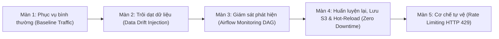

# 🎬 Kịch Bản Demo Full Luồng (End-to-End MLOps Lifecycle)

Tài liệu này cung cấp kịch bản trình diễn chi tiết từng bước cho hệ thống **Vietnamese License Plate Recognition (LPR) MLOps System**. Kịch bản được thiết kế theo đúng câu chuyện vòng đời MLOps thực tế:



---

## 🛠️ 1. Chuẩn bị trước khi Demo

### Bước 1.1: Khởi động hệ thống sạch
Mở terminal tại thư mục gốc của project:
```powershell
# Dọn dẹp volume cũ và dựng mới toàn bộ hạ tầng
docker compose down -v
docker compose up -d --build
```
> [!NOTE]
> Đảm bảo file `.env` đã có đầy đủ cấu hình (`API_ADMIN_TOKEN=lpr-secret-admin-token-2026`, `RATE_LIMIT_PER_MINUTE=60`).

### Bước 1.2: Cài đặt thư viện simulation (trên máy host)
```powershell
pip install -r simulations/requirements.txt
```

### Bước 1.3: Mở sẵn 5 Tab trình duyệt
Trước khi bắt đầu thuyết trình, mở sẵn 5 tab trên trình duyệt:

| Tab | Dịch vụ | URL | Tài khoản đăng nhập | Chức năng cần mở sẵn |
|:---:|---|---|:---:|---|
| **1** | **Grafana Dashboard** | [http://localhost:3000](http://localhost:3000) | `admin` / `admin` | Mở dashboard **LPR System Monitoring**, chọn khoảng thời gian **Last 15 minutes**, bật auto-refresh **10s** |
| **2** | **Prometheus Alerts** | [http://localhost:9090/alerts](http://localhost:9090/alerts) | *(Không cần)* | Xem danh sách các rule cảnh báo (Group `drift_alerts_fast`) |
| **3** | **Airflow Web UI** | [http://localhost:8080](http://localhost:8080) | `admin` / `admin` | Trang chủ DAGs (thấy `lpr_training_pipeline` và `lpr_monitoring_pipeline`) |
| **4** | **MLflow Tracking** | [http://localhost:5000](http://localhost:5000) | *(Không cần)* | Tab **Models** $\rightarrow$ Click vào `lpr-ocr-classifier` |
| **5** | **MinIO S3 Console** | [http://localhost:9001](http://localhost:9001) | `minio` / `minio123` | Vào mục **Buckets** $\rightarrow$ Click vào bucket `mlflow-artifacts` |

---

## 🎬 2. Kịch bản Trình diễn 5 Màn Chi Tiết

---

### MÀN 1: Giới thiệu Kiến trúc & Phục vụ bình thường (Baseline Traffic)
⏱️ **Thời lượng:** ~2 phút  
🎯 **Mục tiêu:** Chứng minh stack đang chạy hoàn hảo, API phục vụ ổn định với độ trễ thấp và độ chính xác cao.

#### 1. Thao tác trên Terminal:
Kiểm tra model hiện tại của API:
```powershell
curl.exe -s http://localhost:8000/model/info
```
> **Giải thích:** API trả về `model_source: "local"` (hoặc `"mlflow"`), `yolo_loaded: true`, sẵn sàng phục vụ.

Tiến hành gửi 100 requests bình thường (Kịch bản 1):
```powershell
python simulations/scenarios.py 1
```

#### 2. Thao tác trên Giao diện:
- Chuyển sang **Tab 1 (Grafana)**:
  - Panel **Inference Requests Throughput**: Ghi nhận lưu lượng đều đặn ~0.8 req/s.
  - Panel **Model Prediction Latency (P50 / P95 / P99)**: P95 latency ở mức an toàn (< 500ms).
  - Panel **Recognition Success Rate**: Tỷ lệ nhận diện đạt ~100%.
  - Panel **/predict HTTP Status Codes**: 100% là mã **HTTP 200 (màu xanh)**.
- Chuyển sang **Tab 2 (Prometheus Alerts)**:
  - Toàn bộ cảnh báo đều ở trạng thái **Inactive (xanh lá cây)**.

🗣️ **Lời thoại gợi ý:**
> *"Hệ thống đang hoạt động trong điều kiện lý tưởng với lưu lượng xe ban ngày rõ nét. Độ trễ P95 đạt dưới 500ms, tỷ lệ nhận dạng biển số hợp lệ đạt tuyệt đối và không có bất kỳ cảnh báo nào bị kích hoạt."*

---

### MÀN 2: Giả lập Trôi dạt Dữ liệu (Data Drift Injection)
⏱️ **Thời lượng:** ~2 phút  
🎯 **Mục tiêu:** Mô phỏng sự cố thực tế ngoài hiện trường khi trời tối dần, camera bị mờ/nhiễu cảm biến làm dữ liệu đầu vào bị trôi dạt (Data Drift).

#### 1. Thao tác trên Terminal:
Kích hoạt kịch bản Nightfall Drift (Kịch bản 2):
```powershell
python simulations/scenarios.py 2
```
> **Giải thích:** Bộ simulator áp dụng pure image transform giảm dần độ sáng (`brightness: 0.6` $\rightarrow$ `0.25`) kết hợp Gaussian noise trên ảnh biển số thật.

#### 2. Thao tác trên Giao diện:
- Chuyển sang **Tab 1 (Grafana)**:
  - Cuộn xuống panel **Input Brightness (5m vs 1h)**:
  - Đường màu vàng (5m mean) **tụt dốc mạnh** so với đường baseline 1h.
- Chuyển sang **Tab 2 (Prometheus Alerts)**:
  - Bấm F5 tải lại trang:
  - Cảnh báo **`InputBrightnessDriftFast`** chuyển từ màu xanh $\rightarrow$ **PENDING** (màu vàng) $\rightarrow$ sau 2 phút chuyển sang **FIRING (màu đỏ rực)**.

🗣️ **Lời thoại gợi ý:**
> *"Khi điều kiện ánh sáng thay đổi đột ngột hoặc camera bị bám bẩn ban đêm, dữ liệu đầu vào đã bị trôi dạt (Data Drift). Nhờ nhóm rule `drift_alerts_fast` với cửa sổ trượt ngắn 5 phút, hệ thống phát hiện và kích hoạt cảnh báo FIRING ngay lập tức trong vòng 2 phút thay vì phải chờ cả tiếng đồng hồ như các hệ thống thông thường."*

---

### MÀN 3: Airflow Monitoring DAG quét & Xuất báo cáo chẩn đoán
⏱️ **Thời lượng:** ~2 phút  
🎯 **Mục tiêu:** Chứng minh hệ thống giám sát tự động của Airflow thay thế việc con người phải trực màn hình 24/7.

#### 1. Thao tác trên Giao diện:
- Chuyển sang **Tab 3 (Airflow)**:
  - Tìm DAG **`lpr_monitoring_pipeline`** (DAG này tự chạy mỗi 15 phút, nhưng để demo ta bấm trigger thủ công).
  - Bấm nút **▶ Trigger DAG**.
  - Nhấp vào DAG $\rightarrow$ chọn tab **Graph** để xem luồng chạy thời gian thực:
    1. `check_api_health`: Kiểm tra uptime và trạng thái API.
    2. `check_model_consistency`: Đối chiếu model version giữa API và MLflow `@production`.
    3. `canary_prediction`: Gửi ảnh mẫu kiểm tra độ trễ thực tế.
    4. `query_prometheus_metrics`: Kéo metrics PromQL từ Prometheus.
    5. `evaluate_health_and_drift`: Đối chiếu ngưỡng $\rightarrow$ phát hiện vi phạm độ sáng (`brightness_drift_ratio > 0.3`).
    6. `write_monitoring_report`: Tạo file báo cáo JSON.
    7. `fail_if_unhealthy`: Task cuối báo đỏ (FAILED) để người vận hành nhận biết hệ thống đang có bất thường trên giao diện.

#### 2. Thao tác trên Terminal / VS Code:
Mở thư mục `data/monitoring_reports/` và xem file báo cáo JSON mới nhất:
```powershell
Get-ChildItem -Path data/monitoring_reports/*.json | Sort-Object LastWriteTime -Descending | Select-Object -First 1 | Get-Content
```
- Chỉ cho người xem thấy nội dung:
  - `"drift_detected": true`
  - Danh sách `"violations"` chỉ rõ: metric `brightness_drift_ratio`, giá trị thực tế và ngưỡng vi phạm.
  - Toàn bộ snapshot telemetry lúc phát hiện sự cố.

🗣️ **Lời thoại gợi ý:**
> *"DAG giám sát tự động của Airflow không chỉ kéo số liệu từ Prometheus mà còn gửi canary test và đối chiếu model version. Khi phát hiện vi phạm độ sáng, DAG ghi nhận báo cáo chẩn đoán chi tiết vào thư mục data và tự động báo hiệu cảnh báo."*

---

### MÀN 4: Huấn luyện lại, Lưu S3 & Hot-Reload Model (Zero Downtime)
⏱️ **Thời lượng:** ~3 phút  
🎯 **Mục tiêu:** Hoàn thiện vòng lặp MLOps: Retrain $\rightarrow$ Đăng ký Model Registry $\rightarrow$ Lưu S3 MinIO $\rightarrow$ Hot Reload API không gián đoạn.

#### 1. Thao tác trên Giao diện Airflow:
- Trên **Tab 3 (Airflow)**:
  - Bấm **▶ Trigger DAG** cho pipeline **`lpr_training_pipeline`**.
  - Xem Graph view quan sát 7 task tự động:
    `generate_data` $\rightarrow$ `validate_data` $\rightarrow$ `extract_features` $\rightarrow$ `train` $\rightarrow$ `evaluate` $\rightarrow$ `register_model` $\rightarrow$ `reload_api`.

#### 2. Thao tác quan sát sau khi Train xong:
- **Tab 5 (MinIO S3)**:
  - Tải lại bucket `mlflow-artifacts`.
  - Show trực tiếp cho người xem thấy thư mục run mới chứa đầy đủ:
    `artifacts/ocr_model/model.pkl`, `MLmodel`, `conda.yaml`.
  - *Điểm nhấn:* Artifacts được lưu trữ bền vững trên Object Storage chuẩn S3 tương thích đám mây (AWS/GCP), không còn lưu local disk.
- **Tab 4 (MLflow)**:
  - Tải lại tab **Models** $\rightarrow$ `lpr-ocr-classifier`.
  - Show thấy alias **`@production`** đã tự động thăng hạng trỏ vào version mới vừa huấn luyện.
- **Tab Terminal (Kiểm tra Hot Reload API)**:
  - Chạy lệnh kiểm tra thông tin model của API:
    ```powershell
    curl.exe -s http://localhost:8000/model/info
    ```
  - **Kết quả:**
    ```json
    {
      "model_source": "mlflow",
      "model_version": "1",
      "feature_method": "hog",
      "classifier": "svm",
      "yolo_loaded": true
    }
    ```
  - *Điểm nhấn tối thượng:* API đã nạp ngay lập tức mô hình mới từ MLflow & MinIO mà **không cần restart container API (Zero Downtime)** nhờ endpoint bảo mật `POST /model/reload` được kích hoạt bởi Airflow task `reload_api` mang `API_ADMIN_TOKEN`.

🗣️ **Lời thoại gợi ý:**
> *"Sau khi huấn luyện và đánh giá mô hình mới đạt chuẩn accuracy, pipeline tự động đăng ký lên MLflow, lưu trữ artifact trên MinIO S3, và gọi lệnh Hot-reload sang API. API chuyển sang phục vụ mô hình mới ngay lập tức mà không mất bất kỳ một giây downtime nào."*

---

### MÀN 5: Kiểm tra Cơ chế Tự vệ (Rate Limiting & Anti-DoS)
⏱️ **Thời lượng:** ~1 phút  
🎯 **Mục tiêu:** Chứng minh hệ thống chuẩn Production có khả năng chống chịu quá tải và tấn công spam request.

#### 1. Thao tác trên Terminal:
Bắn dồn dập 70 requests với tốc độ cao (15 req/s) cố tình vượt ngưỡng 60 req/phút:
```powershell
python simulations/scenarios.py 6
```
- Quan sát bảng summary in ra terminal:
  - `Success (200 OK): 55`
  - `Rate Limited (429): 15`
  - `Client Errors: 0`, `Server Errors: 0`

#### 2. Thao tác trên Giao diện:
- Chuyển sang **Tab 1 (Grafana)**:
  - Panel **/predict HTTP Status Codes**: Xuất hiện cột màu đỏ thể hiện các phản hồi **HTTP 429 (Too Many Requests)**.
  - Panel **Rate-limited requests**: Nhảy số ghi nhận 15 requests bị từ chối.
- Chuyển sang **Tab 2 (Prometheus)**:
  - Alert **`RateLimitBurst`** kích hoạt ngay lập tức (`0m for`).

🗣️ **Lời thoại gợi ý:**
> *"Hệ thống được tích hợp sẵn Token-window Rate Limiter theo từng IP. Khi có đợt spike traffic hoặc tấn công spam, API tự động trả về HTTP 429 kèm header Retry-After để bảo vệ tài nguyên tính toán inference của CPU/GPU."*

---

## ❓ 3. Bộ Câu Hỏi Thường Gặp & Gợi Ý Trả Lời (Defense Q&A)

### Câu 1: "Tại sao nhóm dùng Prometheus cho Drift Detection mà không dùng Evidently AI như thư mục demo?"
> **Trả lời:**  
> *"Dự án demo là bài toán dự đoán dữ liệu bảng (tabular), dữ liệu dạng cột số/chữ nên việc đưa vào Evidently AI để tính KS-test hay Wasserstein distance rất phù hợp.  
> Tuy nhiên, bài toán của nhóm em là Computer Vision (ảnh thô dung lượng lớn). Nếu gửi toàn bộ ảnh vào container Evidently AI sẽ gây nghẽn băng thông, tốn RAM và làm chậm luồng inference.  
> Nhóm em đã trích xuất trực tiếp các đặc trưng thị giác quan trọng (Mean Brightness, Image Resolution, Format Validity Score) ngay trong pipeline và expose dưới dạng Prometheus Metrics. Nhờ đó, việc phát hiện drift diễn ra theo thời gian thực (sub-second) mà không tốn thêm container trung gian."*

### Câu 2: "Tại sao nhóm chọn mô hình MLflow Proxied Artifacts thay vì Direct S3?"
> **Trả lời:**  
> *"Với kiến trúc Proxied (`--serve-artifacts`), chỉ duy nhất container MLflow Server cần giữ AWS Access Key/Secret Key để đọc ghi với MinIO. Các service khác như FastAPI, Airflow, Trainer chỉ cần gọi qua HTTP REST endpoint của MLflow mà không cần cài thêm thư viện boto3 hay quản lý credentials phân tán. Điều này giúp tăng tính bảo mật và giảm độ phụ thuộc thư viện cho container API phục vụ."*

### Câu 3: "Airflow của nhóm có gì khác biệt so với Airflow standalone thông thường?"
> **Trả lời:**  
> *"Airflow standalone mặc định chạy SequentialExecutor trên cơ sở dữ liệu SQLite, mỗi thời điểm chỉ chạy được 1 task đơn lẻ và dễ bị lock database.  
> Nhóm em đã nâng cấp lên kiến trúc Multi-container chuẩn production: tách riêng `airflow-webserver` và `airflow-scheduler` chạy trên PostgreSQL database backend, sử dụng `LocalExecutor` cho phép chạy đồng thời (concurrent) nhiều task trong DAG và đảm bảo tính sẵn sàng cao."*

---

## 🧹 4. Dọn Dẹp Sau Khi Demo
Sau khi kết thúc buổi trình diễn, bạn có thể dừng hệ thống:
```powershell
# Dừng các container (giữ nguyên dữ liệu)
docker compose down

# Hoặc xóa sạch dữ liệu để lần sau demo lại từ đầu
docker compose down -v
```
